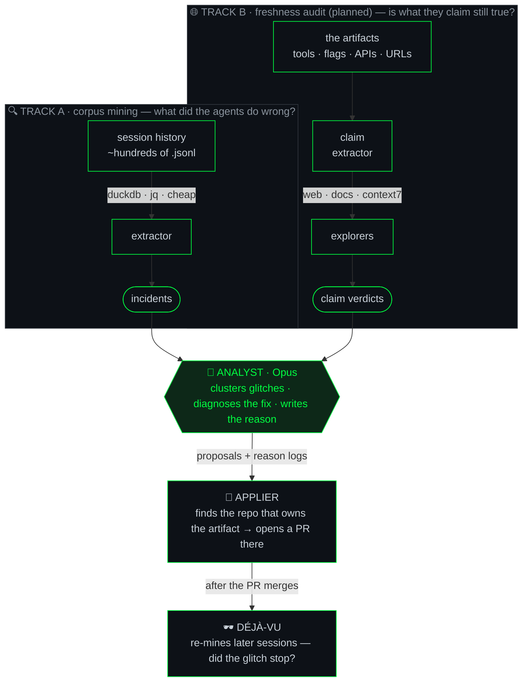

<div align="center">

# 🕶️ agent-smith

**An Agent whose only purpose is propagating improvements into other agents.**

*It patrols the agents-matrix, finds the glitches where reality stuttered, and rewrites the rules so the déjà vu stops happening.*

[](docs/HANDOFF.md)
[](#the-two-ways-it-sees)
[](https://docs.claude.com/en/docs/claude-code)
[](https://nixos.org)
[](LICENSE)

</div>

---

> *"Never send a human to do a machine's job."* — Agent Smith
>
> You keep telling your agents the same thing. *Read skeletons, not whole files.
> That flag was renamed. Don't retry the failing command.* They nod, and three
> sessions later they do it again. That repetition **is** the glitch in the
> matrix — and agent-smith exists to patch it at the source: the instructions
> themselves.

agent-smith reads how your Claude Code agents *actually behaved* across hundreds
of past sessions, checks whether what their instructions *claim* is still true in
the world, and opens pull requests that fix the agent — not the symptom.

It edits the things that steer agents: subagent definitions, skills, `CLAUDE.md`
files, slash commands. Then it writes down **why**, and later checks whether the
glitch actually stopped recurring.

---

## 🕶️ The two ways it sees

agent-smith runs two intelligence tracks into one mind. One looks *backward* at
what happened; the other looks *outward* at what's still true.



**Track A — corpus mining.** Pure SQL (DuckDB) over your `.jsonl` session logs.
No model, no token cost, runs over everything. It hunts four kinds of glitch:

| Signal | The tell |
|--------|----------|
| **tool_error** | a tool call came back as an error |
| **retry** | the identical call re-issued within a few turns — and the earlier attempt **failed** (intentional successful re-runs don't count) |
| **user_correction** | you said *"no"*, *"actually…"*, *"revert that"* — or interrupted |
| **inefficiency** | unbounded whole-file reads where a skeleton would do |

*Repeated guidance* — the same glitch across **≥3 distinct sessions** — is the
analyst's clustering threshold, applied on top of every signal: a pattern, not a
fluke. Big clusters are fed to the Oracle as a **session-stratified sample**
(breadth across sessions before depth) with truthful totals, so even a
2,000-incident cluster fits in one diagnosis.

**Track B — freshness audit** *(planned)*. The backward look can't catch a rule that was right
when written and rotted since. So agent-smith reads the artifacts, extracts every
external claim — a tool name, a CLI flag, a library API, a URL, a "best practice" —
and **fans out one explorer per claim** to check it against the live world
(`context7`, web search, changelogs). `changed` and `dead` claims become fixes.

The design bet: **the extractor is dumb and cheap, the analyst is smart and narrow.**
Cost scales with the number of glitches, not the size of your history.

---

## What it actually changes

Every fix is one of six moves. The interesting one is the last.

| Fix | When | What it does |
|-----|------|--------------|
| **add** | no guidance exists | write the missing rule |
| **strengthen** | the rule exists but gets ignored | raise it, sharpen it, make it imperative |
| **fix-stale** | a flag/API/file the rule names has changed | correct the reference |
| **remove** | the guidance contradicts itself or causes the glitch | cut it |
| **escalate-out-of-instructions** | a *prose* rule keeps failing no matter how loud | stop asking nicely — propose a **hook** |
| **skip** | the current harness/system prompt already enforces it | decline — redundant instructions are their own glitch source |

That last move is the whole philosophy: when a rule is reliably ignored, the
answer isn't a louder rule, it's **defining the error out of existence** —
converting a suggestion the model can rationalize past into deterministic
enforcement the harness runs. agent-smith is allowed to propose that.

Nothing lands silently. Every change ships as a **draft pull request** against
whichever repo owns the artifact — gated by a deterministic **preflight** (title
lint, exactly one commit over `origin/<base>`, no files beyond what the editor
reported) and a subagent **verify** pass — with a **reason log** entry: the
diagnosis, the evidence, the expected effect. You merge; nothing merges itself.
Later, `déjà-vu` re-mines and records whether the glitch rate actually dropped.
*Cause, effect, receipts.*

---

## 📦 Install

agent-smith is a **Claude Code plugin** (this repo doubles as its own
single-plugin marketplace):

```
/plugin marketplace add noamsto/agent-smith
/plugin install agent-smith@agent-smith
```

Then run it:

```
/agent-smith:run          # the whole loop, autonomously → draft PRs
/agent-smith:mine         # extractor → clusters
/agent-smith:propose      # Oracle per cluster → proposals (review-only)
/agent-smith:apply [<id>] # editor → verify → draft PR
/agent-smith:status       # where things stand
```

First run bootstraps everything: the `extractor`/`analyst`/`applier` binaries
(and the `duckdb` CLI, if you don't have one) download automatically for your
OS/arch into `~/.cache/agent-smith/bin`. The only assumptions are `git` and an
authenticated `gh`. Binaries already on PATH — e.g. nix-installed — are used
as-is, never downloaded over.

<details>
<summary>Declarative install (settings.json)</summary>

```json
{
  "extraKnownMarketplaces": {
    "agent-smith": { "source": { "source": "github", "repo": "noamsto/agent-smith" } }
  },
  "enabledPlugins": { "agent-smith@agent-smith": true }
}
```

</details>

<details>
<summary>Nix / Home Manager (engine on PATH)</summary>

Add the flake as an input and import the Home Manager module; it puts the
`extractor`/`analyst`/`applier` binaries on PATH with their deps (duckdb, git,
gh) already wrapped, so the plugin never has to download them:

```nix
# flake.nix
inputs.agent-smith.url = "github:noamsto/agent-smith";

# home.nix (or any Home Manager module)
imports = [ inputs.agent-smith.homeManagerModules.default ];
programs.agent-smith.enable = true;
```

Enable the plugin itself via the `settings.json` keys above.

</details>

## 🔧 Develop

```bash
nix develop                            # devshell: go, duckdb, jq, git, gh, goreleaser
go test ./...                          # full suite
nix build .#default                    # → result/bin/{extractor,analyst,applier}
goreleaser release --snapshot --clean  # local release dry-run → dist/
```

---

## Status

> *"It is inevitable."*

**Phase 1 is live.** The loop — extractor → analyst (Oracle) → applier — is built,
tested, and proven end-to-end on a real corpus. Fittingly, the acceptance-bar
glitch itself (agents ignoring the skeleton-first reading rule: 147 incidents
across 87 sessions) came out the other side as the **first real pull request** —
proposing a PreToolUse hook, the `escalate-out-of-instructions` move, exactly as
designed.

📄 **Design:** [`docs/specs/2026-06-01-agent-smith-design.md`](docs/specs/2026-06-01-agent-smith-design.md) · **Working state:** [`docs/HANDOFF.md`](docs/HANDOFF.md)

**Roadmap**

- ✅ **Phase 1 — MVP.** Track A → analyst → draft PR + reason logs; the
  `/agent-smith` plugin; pre-PR preflight. Acceptance bar met — and shipped as a
  real PR.
- ⏭ **Next.** Declarative install wiring ([#3](https://github.com/noamsto/agent-smith/issues/3)) ·
  HTML status dashboard ([#2](https://github.com/noamsto/agent-smith/issues/2)) ·
  **Track B** freshness audit.
- 🔄 **Phase 2 — the loop.** `déjà-vu` trend validation; scheduled runs;
  auto-commit for self-owned artifacts. The self-improving flywheel.
- 🪝 **Phase 3 — the hook.** Inline capture so future mining gets even cheaper.

---

<div align="center">

🕶️

*There is no spoon. There is only the diff.*

</div>
