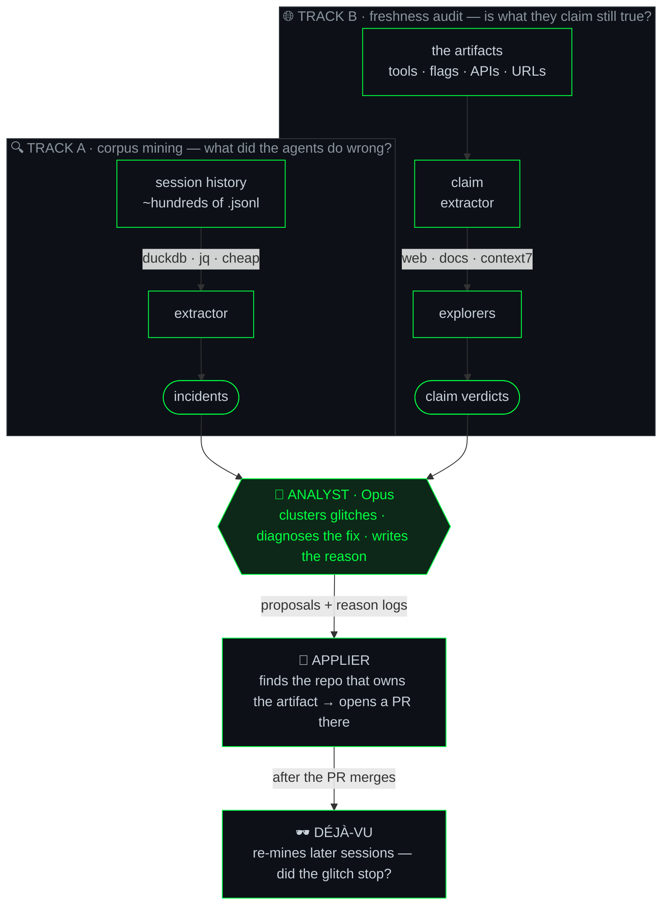

# 🕶️ agent-smith

**An Agent whose only purpose is propagating improvements into other agents.**

*It patrols the agents-matrix, finds the glitches where reality stuttered, and rewrites the rules so the déjà vu stops happening.*

---

> *"Never send a human to do a machine's job."* — Agent Smith
>
> You keep telling your agents the same thing. *Read skeletons, not whole files.
> That flag was renamed. Don't retry the failing command.* They nod, and three
> sessions later they do it again. That repetition **is** the glitch in the
> matrix — and agent-smith exists to patch it at the source: the instructions
> themselves.

agent-smith reads how your Claude Code agents *actually behaved* across hundreds
of past sessions, checks whether what their instructions *claim* is still true in
the world, and opens pull requests that fix the agent — not the symptom.

It edits the things that steer agents: subagent definitions, skills, `CLAUDE.md`
files, slash commands. Then it writes down **why**, and later checks whether the
glitch actually stopped recurring.

---

## 🕶️ The two ways it sees

agent-smith runs two intelligence tracks into one mind. One looks *backward* at
what happened; the other looks *outward* at what's still true.

**Track A — corpus mining.** Pure SQL and `jq` over your `.jsonl` session logs.
No model, no token cost, runs over everything. It hunts five kinds of glitch:

| Signal | The tell |
|--------|----------|
| **tool error / retry** | a command failed, or the agent tried the same thing twice |
| **user correction** | you said *"no"*, *"actually…"*, *"revert that"* — or hit Esc |
| **repeated guidance** | the *same* correction across **≥3 sessions** — a pattern, not a fluke |
| **inefficiency** | reading whole files when a skeleton would do; redundant search chains |
| **orchestrator disagreement** | an Opus orchestrator overruling what its Sonnet subagent reported — the subagent's instructions let it be wrong |

**Track B — freshness audit.** The backward look can't catch a rule that was right
when written and rotted since. So agent-smith reads the artifacts, extracts every
external claim — a tool name, a CLI flag, a library API, a URL, a "best practice" —
and **fans out one explorer per claim** to check it against the live world
(`context7`, web search, changelogs). `changed` and `dead` claims become fixes.

The design bet: **the extractor is dumb and cheap, the analyst is smart and narrow.**
Cost scales with the number of glitches, not the size of your history.

---

## What it actually changes

Every fix is one of five moves. The interesting one is the last.

| Fix | When | What it does |
|-----|------|--------------|
| **add** | no guidance exists | write the missing rule |
| **strengthen** | the rule exists but gets ignored | raise it, sharpen it, make it imperative |
| **fix-stale** | a flag/API/file the rule names has changed | correct the reference |
| **remove** | the guidance contradicts itself or causes the glitch | cut it |
| **escalate-out-of-instructions** | a *prose* rule keeps failing no matter how loud | stop asking nicely — propose a **hook** |

That last move is the whole philosophy: when a rule is reliably ignored, the
answer isn't a louder rule, it's **defining the error out of existence** —
converting a suggestion the model can rationalize past into deterministic
enforcement the harness runs. agent-smith is allowed to propose that.

Nothing lands silently. Every change ships as a **pull request** against whichever
repo owns the artifact, with a **reason log** entry — the diagnosis, the evidence,
the expected effect. Later, `déjà-vu` re-mines and records whether the glitch rate
actually dropped. *Cause, effect, receipts.*

---

## Status

> *"It is inevitable."*

Design-stage. The architecture is specified and approved; implementation is next.

📄 **Full design:** [`docs/specs/2026-06-01-agent-smith-design.md`](docs/specs/2026-06-01-agent-smith-design.md)

**Roadmap**

- **Phase 1 — MVP.** Both tracks → analyst → PR + reason logs. Manual trigger.
  Acceptance bar: correctly catch the skeleton-first whole-file-read glitch and
  trace it to the *existing* rule (strengthen), not a duplicate.
- **Phase 2 — the loop.** `déjà-vu` trend validation; scheduled runs;
  auto-commit for self-owned artifacts. The self-improving flywheel.
- **Phase 3 — the hook.** Inline capture so future mining gets even cheaper.

---

🕶️

*There is no spoon. There is only the diff.*

